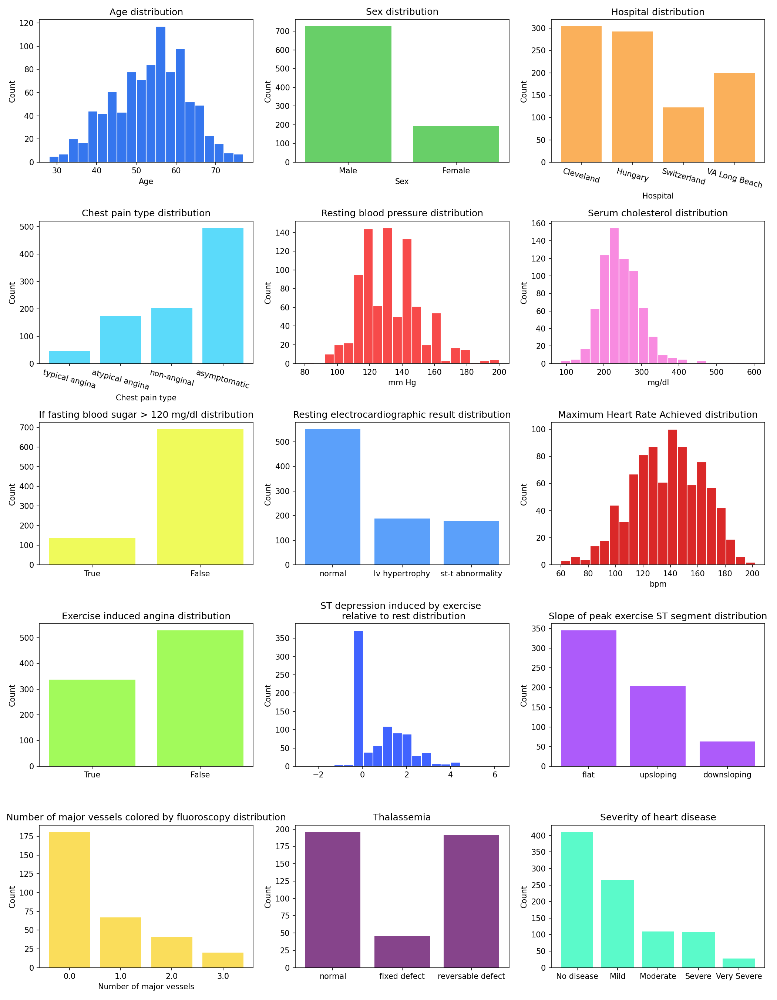
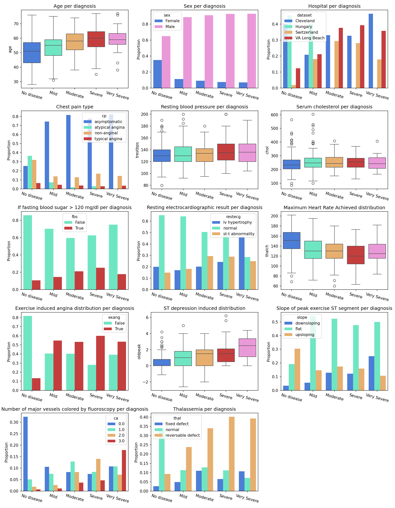
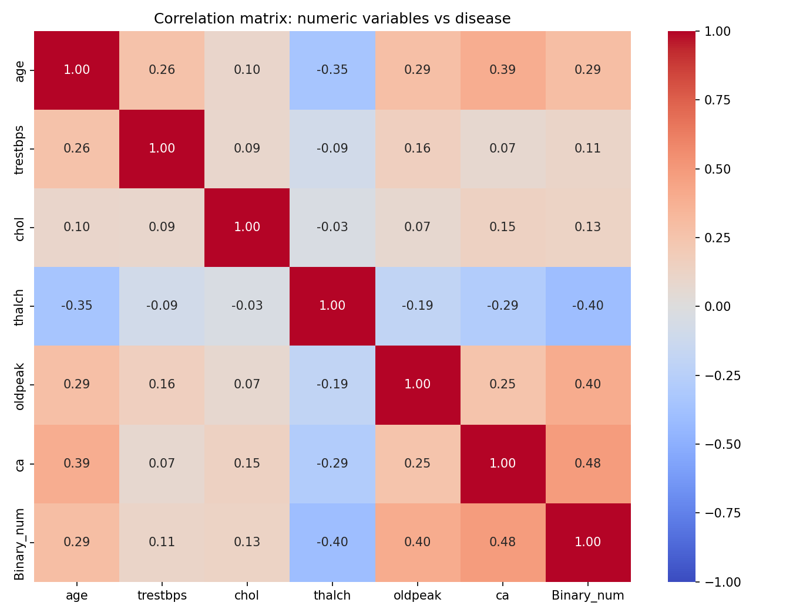

# Heart Disease UCI — Exploratory Data Analysis

## Overview
Exploratory data analysis of the Heart Disease dataset combining clinical data
from 4 hospitals: Cleveland, Hungary, Switzerland, and VA Long Beach.
920 patients, 15 clinical and demographic variables.

## Dataset
Download from Kaggle:
https://www.kaggle.com/datasets/redwankarimsony/heart-disease-data

## Dependencies
```bash
pip install pandas numpy matplotlib seaborn
```
## Notebook Structure
- **Section 1** - Data exploration (shape, types, statistics)
- **Section 2** - Data cleaning (impossible zero values)
- **Section 3** - Missing value analysis (by hospital and disease status)
- **Section 4** - Univariate analysis (distribution of all 15 variables)
- **Section 5** - Bivariate analysis (each variable vs disease severity)
- **Section 6** - Correlation heatmaps (severity and binary)
- **Section 7** - Conclusions

## Key Findings
- **`ca` is the strongest predictor** - number of major vessels colored by 
fluoroscopy shows the highest correlation with both disease presence (0.48) 
and severity (0.53).
- **Most variables correlate more strongly with severity than with disease presence** -
This may suggests that for most variables, the continuous severity scale (0-4) captures 
more clinical signal than a simple disease/no disease split.
- **`chol` and `trestbps` are weak predictors** - contrary to common 
assumption, cholesterol and resting blood pressure show near-zero correlation 
with disease presence, suggesting they are insufficient as standalone predictors.
- **Asymptomatic chest pain is the dominant type in disease patients** - 
counterintuitively, patients with heart disease most commonly report no chest 
pain, which has important implications for clinical screening.
- **Missing data is not random** - missingness in `ca`, `thal`, and `slope`
is concentrated in non-Cleveland hospitals, suggesting systematic differences
in data collection across sites that must be accounted for in any future model.
Some missingness may also reflect clinical decision-making - variables such as
`slope` were less frequently recorded in patients showing no cardiac abnormality,
suggesting the test was not performed when deemed unnecessary.
- **Dataset is heavily skewed** - The vast majority of pacients are healthy, only
28 pacients being within the category "Very Severe". Important to note for future
modeling.

## Plots




